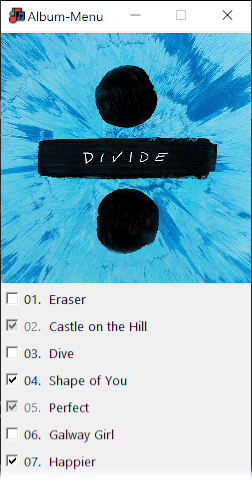

# music_downloader 🎵
This is a simple script that downloads songs automatically and tags them with information found on https://genius.com.

## ID3 Tags
The resulting songs will be mp3's with id3 2.3 tags for compatibility reasons with Windows.  
Although Windows 10 should support v2.4 since the anniversary edition, it still gave me too much headaches.

Fallowing Frames are filled with information:
- **TIT2** Title
- **TPE1** Artist
- **TALB** Album
- **TPE2** Album-Artist
- **TCON** Genre
- **TDRC** Published-Year
- **TRCK** Track-Number
- **USLT** unsynchronized Lyrics
- **APIC** Cover-Front

For more information about the ID3 standard, fallow this [link](http://id3.org/id3v2.3.0 "more information about ID3-Frames")

## Genius bearer token
If you want to use this software head over to [genius](https://genius.com/developers/) and create a developer account.
Once logged in set up a new API Client and generate an Access Token.
When you run the script the first time, it will ask you to enter your generated Token. The Token then gets saved, so you dont need to enter it the next time.

## Requirements and Dependencies
To be able to run this script you need python 3.7+.  
You can download python from their [website](https://www.python.org/downloads/).

Additionally be sure to install FFmpeg from their [site](https://www.ffmpeg.org/download.html).  
The installation-folder needs to be added to the PATH, so that python is able to use it.

Fallowing packages are requered to be installed:  

| Name           | Purpose                                  | Link                                     |
|:--------------:|:-----------------------------------------|------------------------------------------|
| Pillow         | handling cover images                    | https://pypi.org/project/Pillow/         |
| requests       | making requests to the internet          | https://pypi.org/project/requests/       |
| beautifulsoup4 | easy-searching in html documents         | https://pypi.org/project/beautifulsoup4/ |
| pydub          | cutting and converting audio-files       | https://pypi.org/project/pydub/          |
| youtube_dl     | downloading and searching youtube-videos | https://pypi.org/project/youtube_dl/     |
| mutagen        | taging mp3-files with id3 tags           | https://pypi.org/project/mutagen/        |
| tqdm           | displaying simple progressbars           | https://pypi.org/project/tqdm/           |

You can install all these packages with **pip** or **conda**:
```
pip install <package_name>
```
 or `conda install <package_name>` respectively.

## Usage
1. Start the script with typing `python downloader.py` in the console.
A filedialog asks you to locate the text-file containing your songs. This is a new-line delimited "*.txt".
The lines in this file can either be search queries or relative genius-paths (ommit the genius-domain).
That means lines starting with a slash are interpreted as paths and all other lines function as search-queries.
After that it promts you to choose a destination folder. This is where all of you're songs get loaded into.
Watch out for any webm-files in this directory as they will get deleted at the very end of the script.

2. What fallows is a mapping from you're queries from the file to genius paths using their search api.
Lines that were given as paths don't need to be mapped and are hence skipped in this step.
Confirm the mapping by pressing &lt;Return&gt;. In case of wrong mappings, simply type in the correct path by searching on genius manually.

3. All queries mapped, the program will now try to collect information about the songs, this doesn't require any input from the user.

4. After that you have the opportunity to complete the albums the songs were published in.

> For each album a album-menu prompts you to select other songs from the album.  
> If you're done, simply close the window. Repeat this for every Album in your list.



5. In the next step, the script will download all the songs and tag them with id3 tags.

6. Last but not least, all songs are downloaded. Have fun listening!

*Check the information.log file if anything weird happened during runtime.*
